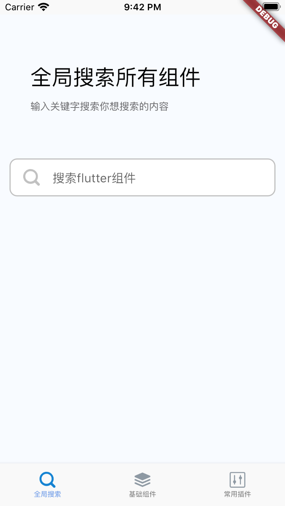
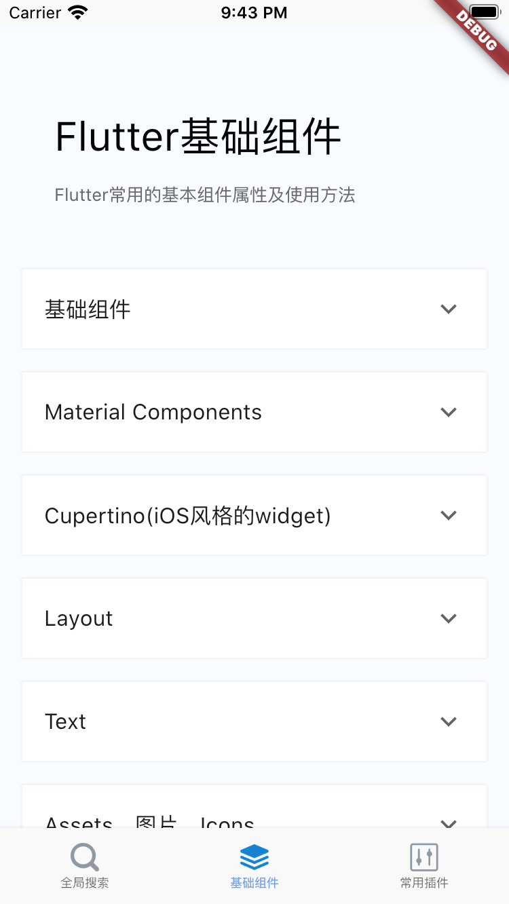
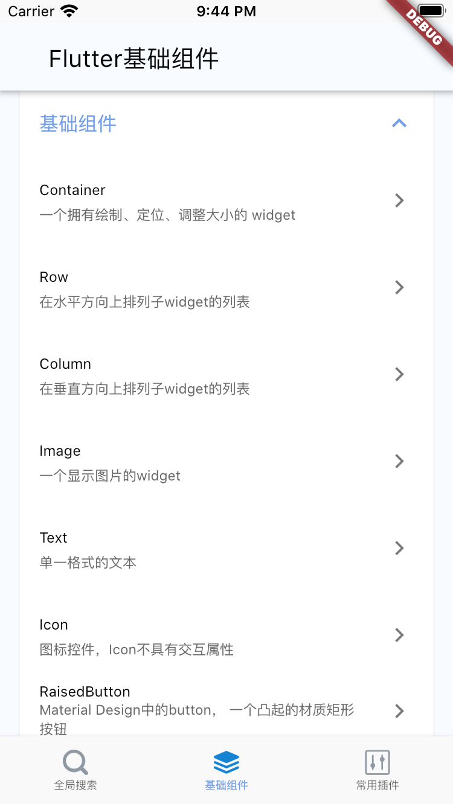
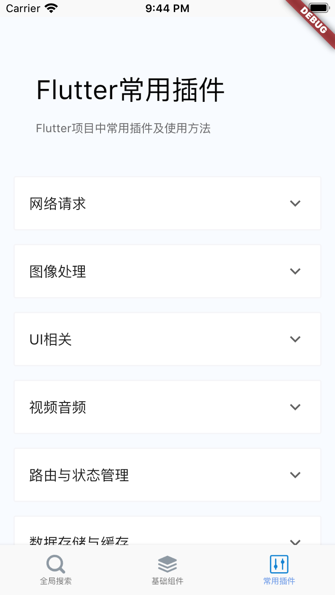
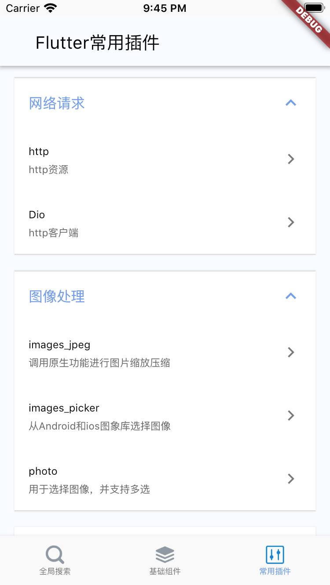
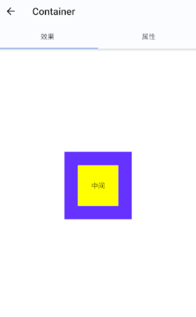
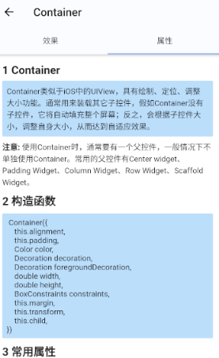
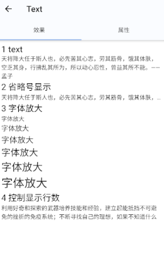
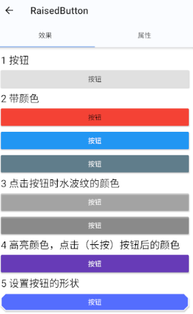
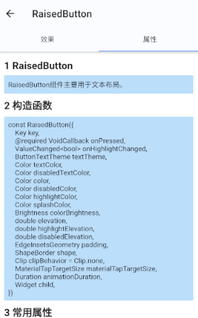

## flutter_app

| 一个帮助flutter开发者快速上手的app  

## 预览  

##### 主结构  
 

  



##### 基础组件  
 

  

 

## Flutter简介  

Flutter是谷歌的移动UI框架，可以快速在iOS和Android上构建高质量的原生用户界面。 Flutter可以与现有的代码一起工作。在全世界，Flutter正在被越来越多的开发者和组织使用，并且Flutter是完全免费、开源的。  

####  Flutter优点  

1. 混合开发中，最接近原生开发的框架；  
2. 性能强大，流畅；  
3. 优秀的路由设计；  
4. 优秀的动画设计；  
5. 简单易学，Dart语言更具优势；  
6. 跨多种平台，减少开发成本；  
7. 支持插件，可以访问原生系统的调用。  


## 计划
  
- [x] 搜索页面  
- [ ] 基础组件  
  - [x] 基础组件
    - [x] Container  
    - [x] Row
    - [x] Column
    - [x] Image 
    - [x] Text
    - [x] Icon
    - [x] RaisedButton
    - [x] Scaffold
    - [x] Appbar
    - [x] FlutterLogo
    - [x] Placeholder
  - [ ] Material Components 
    - [x] BottomNavigationBar
    - [x] TabBar
    - [x] TabBarView
    - [x] MaterialApp
    - [x] WidgetsApp
    - [x] Drawer
    - [x] FloatingActionButton
  - [ ] Cupertino(iOS风格的widget) 
  - [ ] Layout 
  - [ ] Text 
  - [ ] Assets、图片、Icons 
    - [x] Image
  - [ ] Input 
  - [ ] 动画和Motion 
  - [ ] 交互模型 
  - [ ] 样式 
  - [ ] 绘制和效果 
  - [ ] Async 
  - [ ] 滚动 
  - [ ] 辅助功能 
- [x] 常用插件  
  - [ ] 网络请求 
  - [ ] 图像处理 
  - [ ] UI相关 
  - [ ] 视频音频 
  - [ ] 路由与状态管理 
  - [ ] 数据存储与缓存 
  - [ ] 加密相关 
  - [ ] 设备相关 
  - [ ] 地图定位 
  - [ ] WebView 
  - [ ] 支付扩展   

## 运行项目

- 查看版本号
```
flutter --version
```
- 检查开发环境是
```
flutter doctor
```
- 下载依赖
```
flutter packages get
```
- 运行项目
```
flutter run
```  

## 技术交流  
- 微信：li11221107,添加请备注：flutter  

## 微信公众号  

